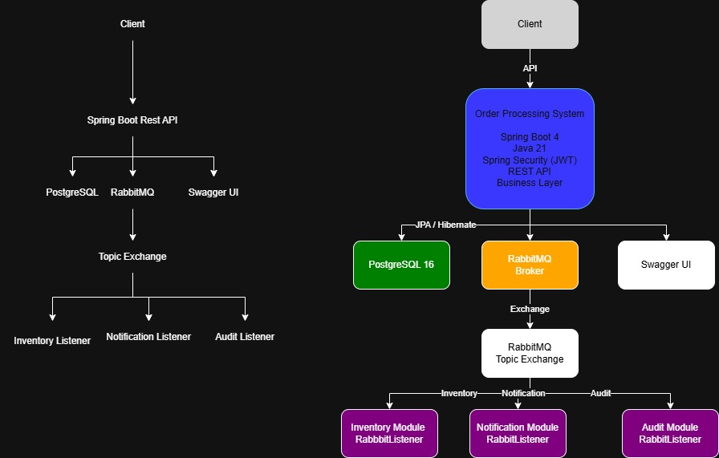
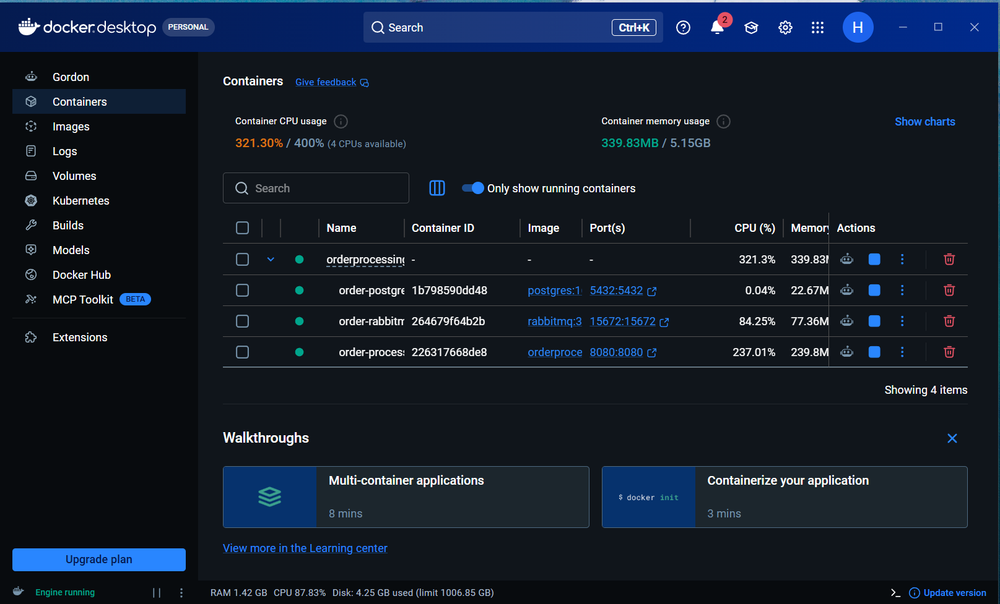
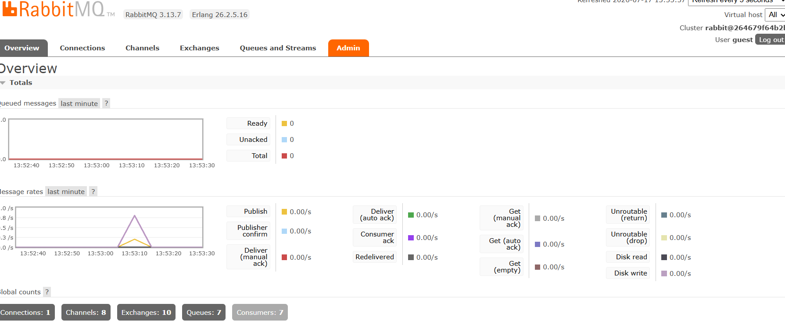
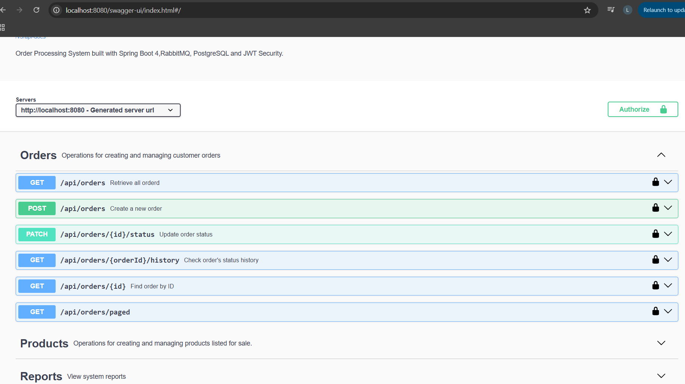
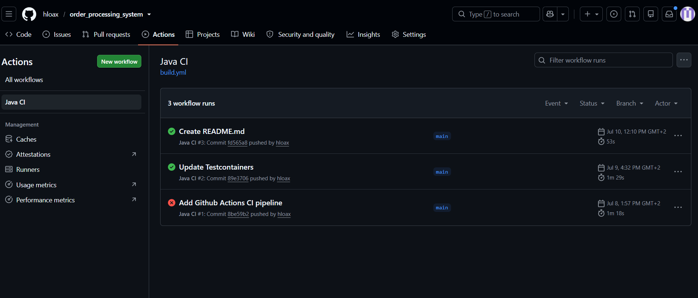

Order Processing System

Overview

A production-style Java backend built with Spring Boot 4 and Java 21
demonstrating secure authentication, event-driven architecture, Docker
deployment, automated testing, and CI/CD.

Architecture

Client -> Spring Boot API -> PostgreSQL -> RabbitMQ -> Inventory /
Notification / Audit Listeners

Features

-   JWT Authentication & Authorization
-   Role-based security
-   Product management
-   Order management
-   Inventory reservation
-   RabbitMQ event publishing and listeners
-   Audit trail
-   Global exception handling
-   Bean Validation
-   Swagger / OpenAPI documentation
-   Docker & Docker Compose support
-   GitHub Actions CI
-   Unit, controller, and integration tests

Tech Stack

Java 21, Spring Boot 4, Spring Security, JWT, PostgreSQL, RabbitMQ,
Docker, Docker Compose, JUnit 5, Mockito, MockMvc, Testcontainers,
Maven, GitHub Actions, Swagger/OpenAPI.

Event Flow

1.  Client creates an order.
2.  Order is saved.
3.  OrderCreatedEvent is published.
4.  Inventory reserves stock.
5.  InventoryReservedEvent is published.
6.  Notification and Audit process the event.

Running the Project

Prerequisites: - Java 21 - Maven - Docker Desktop

Commands: docker compose up -d mvn clean package mvn spring-boot:run

Swagger: http://localhost:8080/swagger-ui/index.html

RabbitMQ: http://localhost:15672

Testing

-   Unit Tests
-   Controller Tests
-   Integration Tests (Testcontainers)
-   GitHub Actions CI

About

Built as a portfolio project showcasing enterprise Java backend
development practices.

# Order Processing System Screenshots

## System Architecture

---

## Docker Deployment

The application runs as three coordinated containers:

- Spring Boot application
- PostgreSQL database
- RabbitMQ message broker

---

## RabbitMQ

RabbitMQ is responsible for asynchronous communication between modules. Order events are published to a Topic Exchange and consumed by Inventory, Notification, and Audit listeners.

---

## API Documentation

Interactive API documentation generated using OpenApi/Swagger

---

## Continuous Integration

GitHub Actions automatically builds and tests the application on every push.

## Event-Driven Architecture

The system uses RabbitMQ to decouple business operations. After an order is successfully created, an `OrderCreatedEvent` is published to a Topic Exchange. Inventory, Notification, and Audit modules consume the event independently, allowing asynchronous processing without blocking the client request.

## Order Processing Sequence

The following sequence diagram illustrates the lifecycle of an order request, from the client through the REST API, data persistance, and asynchronous event publication.

Future Improvements

-   Microservices
-   API Gateway
-   Flyway
-   Redis
-   Kubernetes
-   Prometheus & Grafana
